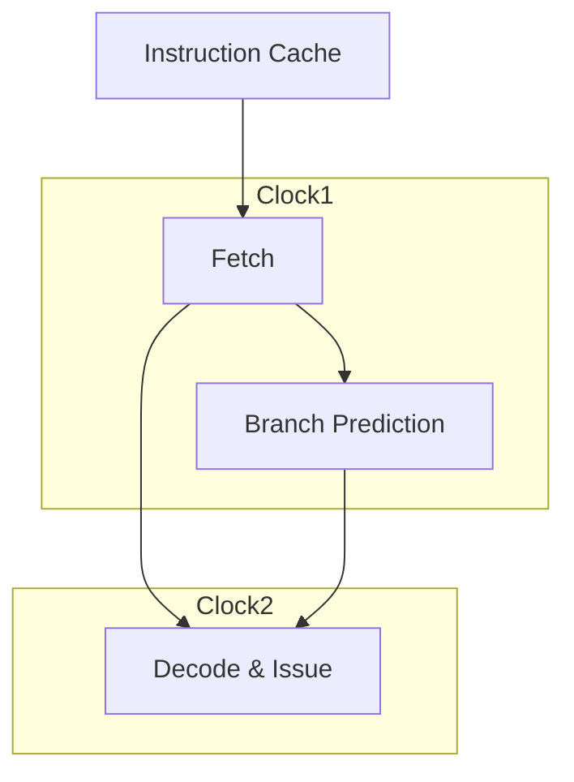

# Instruction Unit

The instruction unit fetches and decodes the instruction at the address stored
in PC.

It takes two clock cycles to handle an instruction. In the first cycle, we
fetch the instruction (since the data from the
[ICache module](cache.md#instruction-cache) use now clock cycle, this cycle
should not be complicated), and predict which branch will be taken if the
instruction is a conditional branch instruction. In the second cycle, we
issue the instruction to the [reservation station](reservation_station.md),
[register file](register_file.md), [reordered buffer](reorder_buffer.md), and
[load/store buffer](load_store_buffer.md). The two steps must be handled
continuously.



## Instruction Unit Module

The Instruction Unit Module is located at `src/instruction_unit.v`.

The Instruction Unit Module takes two clock cycles to fetch an
instruction - fetching & predicting, issuing.

For some complicated jump instructions (JAL, JALR, and conditional branch
instructions), the PC is modified in the issuing stage.

The interfaces are listed below:

```verilog
module InstructionUnit #(
  parameter ROB_WIDTH = 4,
  parameter LSB_WIDTH = 4,
  parameter RS_OP_WITDTH = 4,
  parameter ROB_OP_WIDTH = 2,
  parameter LSB_OP_WIDTH = 3
) (
  input  wire        resetIn,      // resetIn
  input  wire        clockIn,      // clockIn
  input  wire        readyIn,      // readyIn
  input  wire        clearIn,      // clear signal (when branch prediction is wrong)
  input  wire [31:0] newPc,        // the correct PC value
  input  wire        instrInValid, // instruction valid signal (icache)
  input  wire [31:0] instrIn,      // data valid signal (icache)
  input  wire [31:0] instrAddr,    // instruction address (icache)

  // Reservation Station part
  input  wire                    rsFull,        // reservation station full signal
  input  wire                    rsUpdate,      // reservation station update signal
  input  wire [ROB_WIDTH-1:0]    rsRobIndex,    // reservation station rob index
  input  wire [31:0]             rsUpdateVal,   // reservation station value
  output wire                    rsAddValid,    // reservation station add valid signal
  output wire [RS_OP_WITDTH-1:0] rsAddOp,       // reservation station add op
  output wire [ROB_WIDTH-1:0]    rsAddRobIndex, // reservation station add rob index
  output wire [31:0]             rsAddVal1,     // reservation station add value1
  output wire                    rsAddHasDep1,  // reservation station add value1 dependency
  output wire [ROB_WIDTH-1:0]    rsAddConstrt1, // reservation station add value1 constraint
  output wire [31:0]             rsAddVal2,     // reservation station add value2
  output wire                    rsAddHasDep2,  // reservation station add value2 dependency
  output wire [ROB_WIDTH-1:0]    rsAddConstrt2, // reservation station add value2 constraint

  // Reorder Buffer part
  input  wire                    robFull,     // reorder buffer full signal
  input  wire [ROB_WIDTH-1:0]    robNext,     // reorder buffer next index
  input  wire                    robReady,    // reorder buffer ready signal
  input  wire [31:0]             robValue,    // reorder buffer value
  output wire [ROB_WIDTH-1:0]    robRequest,  // reorder buffer request
  output wire                    robAddValid, // reorder buffer add valid signal
  output wire [ROB_WIDTH-1:0]    robAddIndex, // reorder buffer add index
  output wire [ROB_OP_WIDTH-1:0] robAddType,  // reorder buffer add type signal
  output wire                    robAddReady, // reorder buffer add ready signal
  output wire [31:0]             robAddValue, // reorder buffer add value signal
  output wire                    robAddjump,  // reorder buffer add jump signal
  output wire [4:0]              robAddDest,  // reorder buffer add destination register signal
  output wire [31:0]             robAddAddr,  // reorder buffer add address

  // load & Store Buffer part
  input  wire                    lsbFull,         // load & store buffer full signal
  input  wire                    lsbUpdate,       // load & store buffer update signal
  input  wire [ROB_WIDTH-1:0]    lsbRobIndex,     // load & store buffer rob index
  input  wire [31:0]             lsbUpdateVal,    // load & store buffer value
  output wire                    lsbAddValid,     // load & store buffer add valid signal
  output wire                    lsbAddReadWrite, // load & store buffer read/write select
  output wire [ROB_WIDTH-1:0]    lsbAddRobId,     // load & store buffer rob index
  output wire                    lsbAddHasDep,    // load & store buffer has dependency
  output wire [31:0]             lsbAddBase,      // load & store buffer add base addr
  output wire [ROB_WIDTH-1:0]    lsbAddConstrtId, // load & store buffer add constraint index (RoB)
  output wire [31:0]             lsbAddOffset,    // load & store buffer add offset
  output wire [4:0]              lsbAddTarget,    // load & store buffer add target register
  output wire [LSB_OP_WIDTH-1:0] lsbAddOp,        // load & store buffer add op

  // Register File part
  input  wire                 rs1Dirty,      // rs1 dirty signal
  input  wire [ROB_WIDTH-1:0] rs1Dependency, // rs1 dependency
  input  wire [31:0]          rs1Value,      // rs1 value
  input  wire                 rs2Dirty,      // rs2 dirty signal
  input  wire [ROB_WIDTH-1:0] rs2Dependency, // rs2 dependency
  input  wire [31:0]          rs2Value,      // rs2 value
  output wire                 rfUpdateValid, // register file update valid signal
  output wire [4:0]           rfUpdateDest,  // register file update destination
  output wire [ROB_WIDTH-1:0] rfUpdateRobId, // register file update value

  // Predictor part
  input wire jump // jump signal
);
endmodule
```

### Requirements for other connected Modules
*Any unmentioned behaviour is implementation-defined.*

#### Update [Register File](register_file.md)
The circuit that handles the updating work of the register file should use
combinatorial logic.

#### Update [Reorder Buffer](reorder_buffer.md)
The circuit that handles the updating work of the reorder buffer should use
sequential logic that work on the positive edge of the clock signal within
one clock cycle.

#### Check the Constraint of Register Source
The circuit that checks the constraint of register source should use
sequential logic that work on the positive edge of the clock signal within
one clock cycle. During the checking procedure, the module should first check
in the [register file](register_file.md) module to find out whether the
register source has a constraint or not. If so, a request for the value of
the constraint (by the index of the value) will then be sent to
[reorder buffer](reorder_buffer.md) module. The reorder buffer module will
then return the value of the constraint to the register file module.
