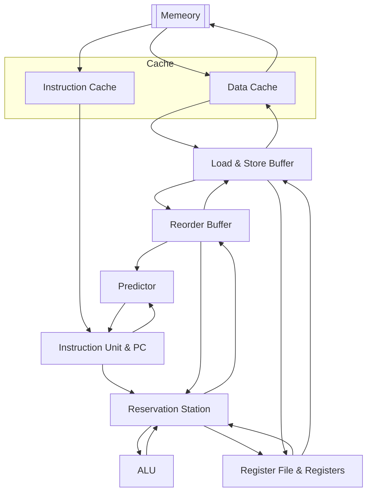

# Overivew of the CPU Architecture

## Diagram

## Components

### Cache (Instruction Cache & Data Cache)

Cache includes instruction cache (icache) and data cache (dcache).

In this design, every data is read from cache. Instruction cache is read only,
while data cache can be either written or read.

See the [document for Cache](cache.md) for more details.

### Instruction Unit

The instruction unit fetches and decodes the instruction at the address
stored in PC. PC is also a part of the instruction unit.

See the [document for Instruction Unit](instruction_unit.md) for more details.

### Predictor

Predictor predicts which branch will probably be taken when encounters branch
statement. [Reorder buffer](#reorder-buffer) gives predictor data to predict.

See the [document for Predictor](predictor.md) for more details.

### Load & Store Buffer

Load & Store Buffer is used to commit changes to memory. Since the only way
to access memory is to use the cache, these commits is actually pushed into
cache.

See the [document for Load & Store Buffer](load_store_buffer.md) for more
details.

### Reorder Buffer

The reorder buffer (RoB) is a buffer that track the states of instructions
that have not yet committed.

The entries in RoB have two state - ready or not ready. If the first entry
is ready, we commit this data into the register.

See the [document for Reorder Buffer](reorder_buffer.md) for more details.

### Reservation Station

The reservation station is a table that records the pending or executing
instructions. When an instruction have just finished calculating, the data
is sent to the RoB for committing this result.

See the [document for Reservation Station](reservation_station.md) for more
details.

### Register File

The register file is a table that records the latest dependency of each
register.

See the [document for Register File](register_file.md) for more details.
