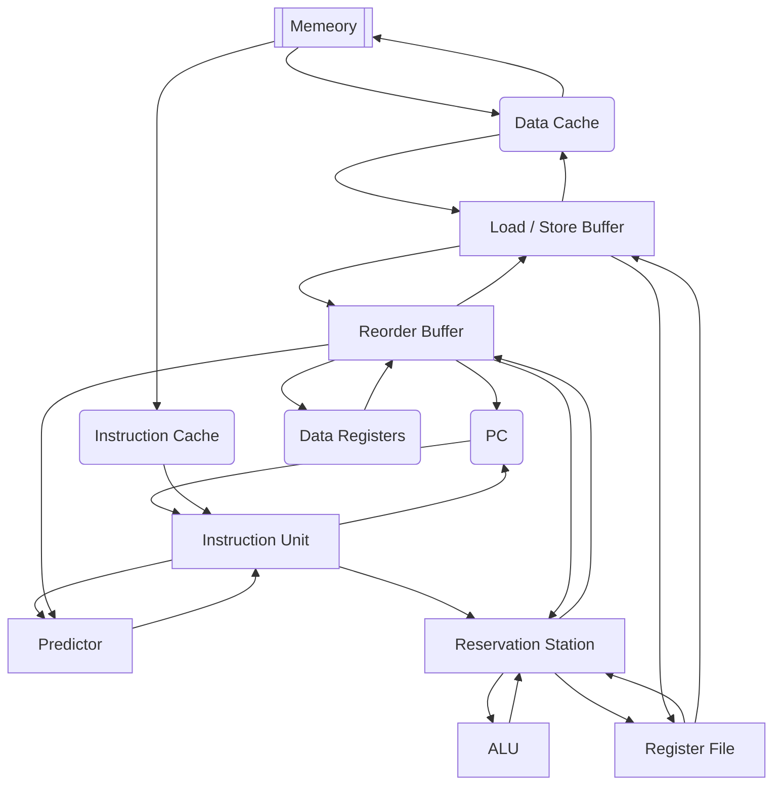

# Overivew of the CPU Architecture

## Diagram

## Components

### Cache (Instruction Cache & Data Cache)

Cache includes instruction cache (icache) and data cache (dcache).

In this design, every data is read from cache. Instruction cache is read only, while data cache can be either written or read.

### Instruction Unit

The instruction unit fetches and decodes the instruction at the addression stored in PC.

### Predictor

Predictor predicts which branch will probably be taken when encounters branch statement. [Reorder buffer](#reorder-buffer) gives predictor data to predict.

### Load / Store Buffer

Load / Store Buffer is used to commit changes to memory. Since the only way to access memory is to use the cache, these commits is actually pushed into cache.

### Reorder Buffer

The reorder buffer (RoB) is a buffer that track the state of instructions that are not yet committed.

The entries in RoB have two state - ready or not ready. If the first entry is ready, we commit this data into the register.

### Reservation Station

The reservation station is a table that records the pending or executing instructions. When an instruction have just finished calculating, the data is sent to the RoB for committing this result.

### Register File

The register file is a table that records the latest dependency of each register.
